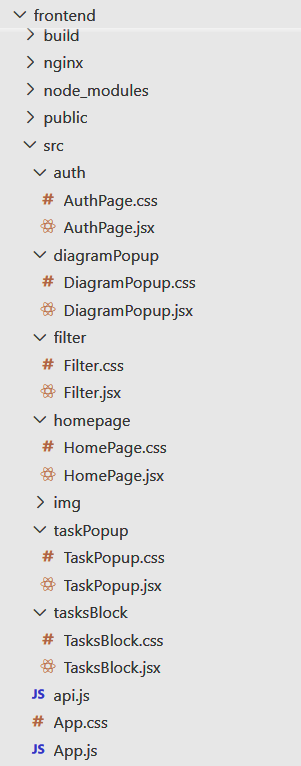

# 🖥️ Task Manager Frontend

Данный репозиторий содержит **клиентскую часть** приложения по управлению задачами. Приложение реализовано на **React** с использованием компонентного подхода и модульных стилей.

## ⚙️ Технологии
- React
- JavaScript (JSX)
- CSS

## 📁 Структура проекта

Основной код находится в директории `src`, где выделены логические блоки приложения:

- `auth/` — компоненты и стили для страницы авторизации.
- `diagramPopup/` — модальное окно с круговой диаграммой.
- `filter/` — фильтры задач.
- `homepage/` — главная страница приложения.
- `taskPopup/` — окно создания и редактирования задач.
- `tasksBlock/` — отображение списка задач.
- `img/` — изображения проекта.
- `api.js` — взаимодействие с сервером.
- `App.js`, `App.css` — точка входа и общие стили.

## 🔐 Тестовый аккаунт
- **Имя пользователя:** `php`  
- **Пароль:** `123`

## 🖼 Структура проекта

---

💡 Интерфейс предназначен для работы с задачами: их фильтрации, отображения, редактирования и визуального представления. Проект демонстрирует основы построения SPA-приложений с использованием React. Автор проекта не обладает компетенциями проектирования UX/UI дизайна цифровых продуктов, проект учебный, выполнен в рамках основения дисциплины по разработке клиент-серверных приложений.
